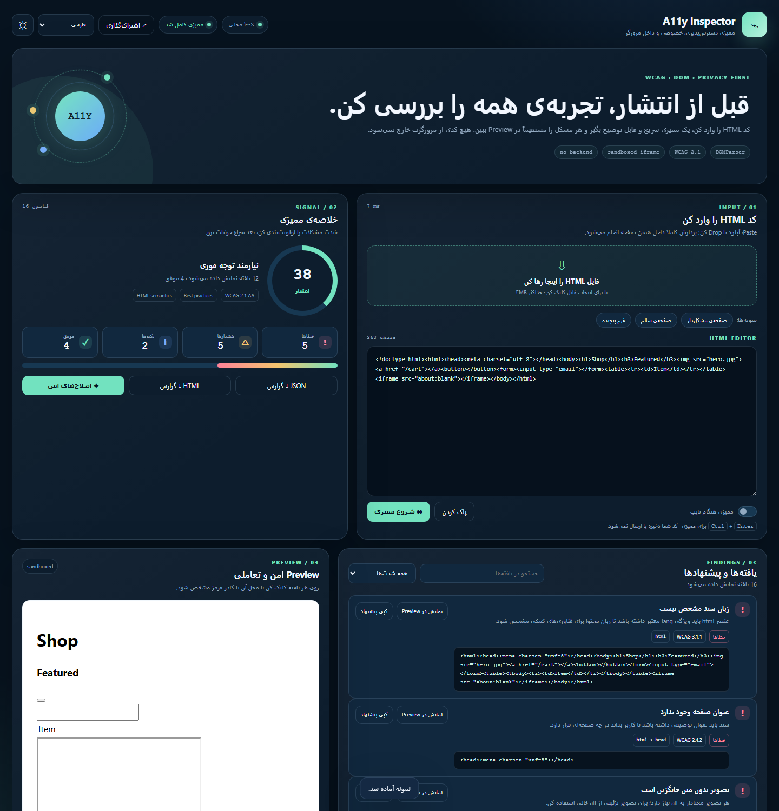
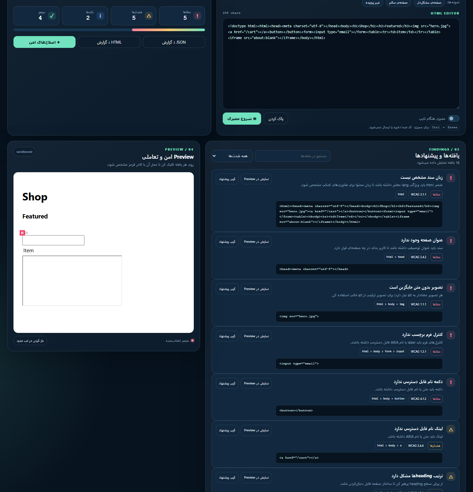
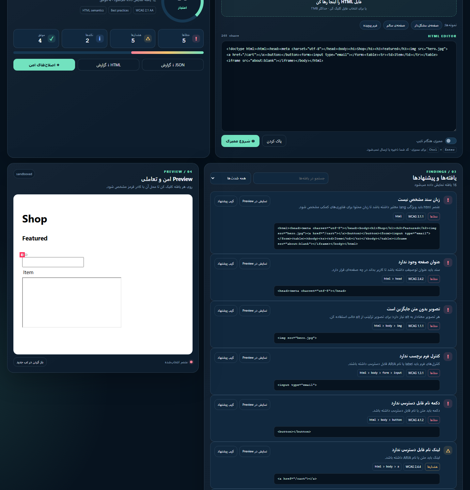

# A11y Inspector

> یک ابزار ممیزی دسترس‌پذیری HTML، خصوصی و کاملاً داخل مرورگر.

**نسخه‌ی نمایشی / Live demo:** <https://mohsen-niksirat.github.io/A11y-Inspector/>

[فارسی](#فارسی) · [English](#english) · [العربية](#العربية) · [Deutsch](#deutsch) · [Français](#français) · [Español](#español)

---

## فارسی

A11y Inspector یک ابزار Static برای بررسی اولیه‌ی دسترس‌پذیری HTML است. کد شما با `DOMParser` داخل مرورگر تحلیل می‌شود، نتیجه با Severity و Selector نمایش داده می‌شود و عنصر مرتبط در یک `iframe sandboxed` قابل مشاهده است.

### امکانات

- ورود HTML با Paste، آپلود فایل یا Drag & Drop
- سه نمونه‌ی آماده برای صفحه‌ی مشکل‌دار، صفحه‌ی سالم و فرم
- بررسی `lang`، `title`، `alt` تصویر، نام قابل دسترس فرم، دکمه و لینک
- بررسی ترتیب Heading، `main`، شناسه‌های تکراری، ارجاع‌های ARIA و `tabindex`
- بررسی جدول، iframe، Skip Link و viewport
- امتیاز ۰ تا ۱۰۰، زمان اجرا و شمارش Error/Warning/Notice/Passed
- جستجو و فیلتر یافته‌ها
- Highlight عنصر واقعی در Preview
- اصلاح امن محدود برای `lang`، `title` و عنوان iframe؛ متن alt حدس زده نمی‌شود
- خروجی JSON و HTML و کپی گزارش
- Share Link برای HTMLهای کوچک
- بررسی کنتراست متن و اجزای رابط با نسبت محاسبه‌شده (WCAG 1.4.3): رنگ‌های inline و کلاس‌ها و بلوک‌های `<style>` با رعایت Specificity، آستانه‌ی ۳ به ۱ برای متن درشت، ارجاع کنترل‌های غیرفعال، رنگ placeholder و ارزیابی سند‌های Dark مستقل با توکن‌های `prefers-color-scheme` و `[data-theme=dark]`
- نصب به‌صورت PWA و اجرای آفلاین
- فارسی، انگلیسی، عربی، آلمانی، فرانسوی و اسپانیایی با RTL/LTR واقعی
- Dark/Light theme و طراحی Responsive

### اسکرین‌شات‌ها

| ممیزی و یافته‌ها | Preview امن | گزارش |
| --- | --- | --- |
|  |  |  |

### اجرا

هیچ نصب یا Backend لازم نیست. فایل `index.html` را با یک Static Server باز کن:

```bash
python -m http.server 4173 --directory A11y-Inspector
```

سپس به `http://localhost:4173` برو. بازکردن مستقیم فایل هم معمولاً کار می‌کند، اما Static Server برای Preview و Share قابل‌اعتمادتر است.

### اجرای CLI بدون مرورگر

موتور ممیزی بدون رابط کاربری هم اجرا می‌شود (نیازمند Node 22+ و `npm install` برای jsdom):

```bash
node cli.mjs page.html --json     # خروجی JSON
node cli.mjs < page.html          # گزارش متنی از stdin
node cli.mjs page.html --fix      # اعمال اصلاح‌های امن و چاپ HTML اصلاح‌شده
node cli.mjs --self               # ممیزی خودِ index.html پروژه
node cli.mjs page.html --fail-on error   # کد خروج ۱ اگر خطایی وجود داشته باشد
node cli.mjs page.html --min-score 90    # کد خروج ۱ اگر امتیاز کمتر از ۹۰ باشد
node cli.mjs page.html --baseline .a11y-baseline.json            # شکست فقط در صورت افت نسبت به خط پایه
node cli.mjs page.html --baseline b.json --update-baseline       # ثبت خط پایه از وضعیت فعلی
node cli.mjs page.html --github                                  # حاشیه‌نویسی ::error/::warning برای GitHub Actions
```

پرچم‌های **CI**: اگر سند حداقل یک خطا (یا با `--fail-on warning`، حتی هشدار) داشته باشد یا امتیاز از حد نصاب کمتر باشد، فرآیند با کد ۱ متوقف می‌شود و رگرسیون دسترس‌پذیری بیلد را می‌شکند.

**حالت خط پایه (`--baseline`):** به‌جای آستانه‌ی ثابت، وضعیت فعلی را با یک فایل خط پایه‌ی متعهدشده مقایسه می‌کند — فقط «افت امتیاز» یا «افزایش خطا/هشدار» بیلد را می‌شکند، پس اسناد ناقص اما پایدار بیلد را نمی‌شکنند. با `--update-baseline` بسازید و فایل را کامیت کنید:

```json
{ "tool": "a11y-inspector", "score": 94, "counts": { "errors": 0, "warnings": 1, "notices": 2 } }
```

**حاشیه‌نویسی‌های Actions (`--github`):** برای هر یافته یک `::error`/`::warning`/`::notice` به stderr می‌نویسد با `title`، `file` و در صورت امکان شماره‌ی خط — تا رگرسیون‌ها مستقیماً در نمای Diff پول‌ریکوئست ظاهر شوند. داخل GitHub Actions خودکار فعال می‌شود (`GITHUB_ACTIONS=true`) و خروجی stdout همچنان JSON تمیز می‌ماند.

### تبدیل چک a11y به چک اجباری

برای اینکه merge بدون وضعیت سبز `a11y/self-audit` ممکن نباشد:

1. به `Settings → Branches → Add branch protection rule` بروید (یا قانون شاخه‌ی `main` را ویرایش کنید).
2. گزینه‌ی **Require status checks to pass before merging** را فعال کنید.
3. در جستجو، `a11y/self-audit` را انتخاب کنید (پس از اولین اجرای موفق CI قابل انتخاب می‌شود).
4. همین کار برای `CI / verify` هم توصیه می‌شود.

نکته: پس از فعال‌شدن، اگر CI قرمز شود merge قفل می‌شود تا رگرسیون برطرف شود؛ برای موارد استثنا، خط پایه را با `--update-baseline` به‌روز کنید و دلیلش را در PR بنویسید.

### Deploy روی GitHub Pages

1. محتویات این پوشه در شاخه‌ی `main` ریپازیتوری باشد.
2. در GitHub به مسیر زیر برو:
   `Settings → Pages → Build and deployment → Source: Deploy from a branch`
3. شاخه‌ی `main` و پوشه‌ی `/(root)` را انتخاب کن و **Save** بزن.
4. بعد از حدود یک دقیقه، آدرس سایت در بالای صفحه‌ی Pages نمایش داده می‌شود.
5. آدرس واقعی را در بخش Screenshots و بالا‌ی همین README به‌جای لینک نمونه قرار بده.

این پروژه به سرویس خارجی نیاز ندارد و برای GitHub Pages مناسب است.

### حریم خصوصی و محدودیت‌ها

- HTML به سرور ارسال نمی‌شود و در LocalStorage ذخیره نمی‌شود.
- LocalStorage فقط زبان و Theme را نگه می‌دارد.
- Preview با `iframe sandbox="allow-same-origin"` اجرا می‌شود و Scriptهای ورودی اجازه‌ی اجرا ندارند.
- این ابزار جایگزین تست با صفحه‌خوان، کیبورد، کنتراست واقعی و بررسی انسانی نیست.
- Share Link محتوای HTML را در Hash آدرس قرار می‌دهد؛ برای کدهای حساس از Share استفاده نکن.

---

## English

A11y Inspector is a static, privacy-first HTML accessibility checker. It parses your markup with `DOMParser` in the browser, reports explainable findings with severity and selectors, and shows the related element inside a sandboxed Preview.

### Features

- Paste, file upload, and drag-and-drop HTML input
- Problem, accessible, and complex-form samples
- Checks for `lang`, `title`, image `alt`, accessible names, headings, main landmark, duplicate IDs, ARIA references, positive `tabindex`, tables, iframes, skip links, viewport, and **WCAG 1.4.3 text & UI contrast with the computed ratio** — inline styles, classes, and `<style>` blocks are resolved with CSS specificity, large text uses the 3:1 threshold, disabled controls are exempt, placeholder color is checked, and dark documents are evaluated against their own tokens (`prefers-color-scheme` blocks and `[data-theme=dark]` rules)
- 0–100 score with Error/Warning/Notice/Passed counts and audit duration
- Search and severity filtering
- Element highlighting in the Preview
- Conservative safe fixes for missing `lang`, document `title`, and iframe titles
- JSON and HTML report downloads plus copyable report text
- Hash-based share links for small HTML documents
- Installable PWA with offline support (service worker + web manifest)
- Persian, English, Arabic, German, French, and Spanish with real RTL/LTR switching
- Dark/light theme and responsive layout

### Screenshots

| Audit & findings | Sandboxed preview | Report |
| --- | --- | --- |
|  |  |  |

### Run locally

```bash
python -m http.server 4173 --directory A11y-Inspector
```

Open `http://localhost:4173`. No package manager, build step, or backend is required. Run the engine tests with `npm test`.

### Headless CLI

The audit engine also runs without the UI (Node 22+, `npm install` for jsdom):

```bash
node cli.mjs page.html --json     # machine-readable JSON
node cli.mjs < page.html          # pretty text report from stdin
node cli.mjs page.html --fix      # apply safe fixes, print the fixed HTML
node cli.mjs --self               # audit the project's own index.html
node cli.mjs page.html --fail-on error   # exit 1 if any error finding exists
node cli.mjs page.html --min-score 90    # exit 1 if score < 90
node cli.mjs page.html --baseline .a11y-baseline.json            # fail only on regression vs baseline
node cli.mjs page.html --baseline b.json --update-baseline      # write baseline from the current audit
node cli.mjs page.html --github                                 # ::error/::warning annotations for GitHub Actions
```

The **CI gating flags** exit with code 1 when the document has at least one error (or, with `--fail-on warning`, even a warning) or scores below the threshold — so an accessibility regression breaks the build.

**Baseline mode (`--baseline`):** instead of a fixed threshold, compare the current audit against a committed baseline file — only a *score drop* or *increase in errors/warnings* fails the build, so imperfect-but-stable documents don't block CI. Create it with `--update-baseline` and commit the file:

```json
{ "tool": "a11y-inspector", "score": 94, "counts": { "errors": 0, "warnings": 1, "notices": 2 } }
```

**Actions annotations (`--github`):** writes one `::error`/`::warning`/`::notice` workflow command per finding to stderr with `title`, `file` and — where the snippet can be located — a `line`, so regressions render inline in the pull-request diff view. It auto-enables inside GitHub Actions (`GITHUB_ACTIONS=true`), and stdout stays clean JSON.

### Make the a11y check required

To make merging impossible while `a11y/self-audit` is red:

1. Open `Settings → Branches → Add branch protection rule` (or edit the `main` branch rule).
2. Enable **Require status checks to pass before merging**.
3. Search for and select `a11y/self-audit` (it becomes searchable after the first successful CI run on the branch).
4. Doing the same for `CI / verify` is recommended.

Note: once required, a red CI locks merging until the regression is fixed. For deliberate exceptions, refresh the baseline with `--update-baseline` and explain the change in the PR.

### GitHub Pages

1. Make sure the repository content lives on the `main` branch.
2. Go to `Settings → Pages → Build and deployment → Source: Deploy from a branch`.
3. Select the `main` branch and the `/(root)` folder, then click **Save**.
4. After about a minute, the site URL appears at the top of the Pages settings.
5. Put the real URL in the Screenshots section and the top of this README instead of the sample link.

### Privacy and scope

HTML is analyzed locally and is not uploaded or persisted. Only language and theme preferences use LocalStorage. The Preview is rendered in a sandboxed iframe with scripts disabled. This is an initial automated audit, not a replacement for keyboard, screen-reader, contrast, zoom, and human testing. Share links put HTML in the URL hash, so do not share sensitive markup.

---

## العربية

A11y Inspector أداة ثابتة وفورية لفحص إمكانية الوصول إلى HTML داخل المتصفح. يتم تحليل الشفرة محلياً باستخدام `DOMParser`، وتظهر النتائج مع مستوى الخطورة والمسار، ويمكن إبراز العنصر داخل معاينة آمنة.

### المزايا

- لصق HTML أو رفعه أو سحبه وإفلاته
- أمثلة لصفحة بها مشكلات وصفحة سليمة ونموذج معقد
- فحص اللغة والعنوان و`alt` والصور وأسماء عناصر النماذج والأزرار والروابط
- فحص العناوين و`main` والمعرّفات المكررة ومراجع ARIA و`tabindex` والجداول وiframe ورابط التخطي وviewport
- درجة من 0 إلى 100 مع عدادات الأخطاء والتحذيرات والملاحظات والاختبارات الناجحة
- البحث والتصفية وإبراز العناصر وتصدير JSON وHTML
- إصلاحات محافظة للغة والعنوان وعناوين iframe
- ست لغات مع دعم RTL/LTR ومظهر داكن وفاتح

### التشغيل والنشر

```bash
python -m http.server 4173 --directory A11y-Inspector
```

يمكن نشر المجلد مباشرة على GitHub Pages من الفرع `main` والمجلد الجذر. لا يوجد خادم أو تثبيت مطلوب.

### الخصوصية

لا يتم إرسال HTML إلى أي خادم ولا يتم حفظه. يتم حفظ اللغة والمظهر فقط. المعاينة تعمل داخل iframe معزول. رابط المشاركة يضع HTML في جزء العنوان، لذلك لا تستخدمه مع محتوى حساس.

---

## Deutsch

A11y Inspector ist ein statisches, datenschutzfreundliches Prüfwerkzeug für HTML-Barrierefreiheit. Das Markup wird mit `DOMParser` lokal im Browser analysiert und die betroffenen Elemente erscheinen in einer sicheren Vorschau.

### Funktionen

- HTML einfügen, hochladen oder per Drag & Drop öffnen
- Beispiele für problematische, zugängliche und komplexe Formulare
- Prüfungen für Sprache, Seitentitel, Bild-Alternativtext, zugängliche Namen, Überschriften, Main-Landmark, doppelte IDs, ARIA-Referenzen, positive `tabindex`-Werte, Tabellen, iframes, Skip-Link und viewport
- Score von 0 bis 100, Filter, Suche und Element-Highlighting
- JSON-/HTML-Berichte und konservative Korrekturen
- Persisch, Englisch, Arabisch, Deutsch, Französisch und Spanisch mit RTL/LTR-Unterstützung
- Dark-/Light-Theme und Responsive Design

### Start und Deployment

```bash
python -m http.server 4173 --directory A11y-Inspector
```

Danach `http://localhost:4173` öffnen. Der Ordner kann direkt über GitHub Pages aus `main` und dem Root-Verzeichnis veröffentlicht werden. Es gibt kein Backend.

### Datenschutz

HTML verlässt den Browser nicht und wird nicht gespeichert. Nur Sprache und Theme werden lokal gemerkt. Die Vorschau läuft in einem sandboxed iframe. Share-Links legen HTML in den URL-Hash und sind daher nicht für vertrauliche Inhalte gedacht.

---

## Français

A11y Inspector est un outil statique et respectueux de la vie privée pour auditer l’accessibilité HTML. Le code est analysé localement avec `DOMParser`, puis les résultats sont affichés avec leur gravité, leur sélecteur et une prévisualisation sécurisée.

### Fonctionnalités

- Coller, importer ou déposer du HTML
- Exemples de page problématique, accessible et formulaire complexe
- Vérifications de `lang`, du titre, des textes `alt`, des noms accessibles, des titres, du landmark principal, des IDs dupliqués, des références ARIA, de `tabindex`, des tableaux, iframes, liens d’évitement et viewport
- Score de 0 à 100, recherche, filtres et surbrillance dans l’aperçu
- Rapports JSON/HTML et corrections automatiques prudentes
- Six langues avec bascule RTL/LTR, thème sombre/clair et interface responsive

### Utilisation et GitHub Pages

```bash
python -m http.server 4173 --directory A11y-Inspector
```

Ouvrez `http://localhost:4173`, puis publiez le dossier directement avec GitHub Pages depuis `main` et la racine. Aucun serveur applicatif n’est nécessaire.

### Confidentialité

Le HTML reste dans le navigateur et n’est pas enregistré. Seules la langue et le thème sont mémorisés. L’aperçu utilise un iframe sandboxé. Les liens de partage placent le HTML dans le hash de l’URL; évitez-les pour les données sensibles.

---

## Español

A11y Inspector es una herramienta estática y privada para auditar la accesibilidad de HTML. Analiza el marcado localmente con `DOMParser`, muestra hallazgos explicables y permite ver el elemento relacionado en una vista previa aislada.

### Funciones

- Pegar, subir o arrastrar HTML
- Ejemplos de página problemática, accesible y formulario complejo
- Revisiones de idioma, título, `alt`, nombres accesibles, encabezados, landmark principal, IDs duplicados, referencias ARIA, `tabindex`, tablas, iframes, enlace de salto y viewport
- Puntuación de 0 a 100, búsqueda, filtros y resaltado de elementos
- Informes JSON/HTML, copia del informe y correcciones seguras limitadas
- Seis idiomas, RTL/LTR, tema oscuro/claro y diseño responsive

### Uso y publicación

```bash
python -m http.server 4173 --directory A11y-Inspector
```

Abre `http://localhost:4173`. Puedes publicar la carpeta directamente en GitHub Pages desde `main` y la raíz. No hay backend ni instalación.

### Privacidad

El HTML no sale del navegador ni se guarda. Solo se almacenan el idioma y el tema. La vista previa usa un iframe sandboxed. Los enlaces compartidos incluyen el HTML en el hash de la URL; no los uses con contenido confidencial.

---

## License

MIT — see [LICENSE](LICENSE).
